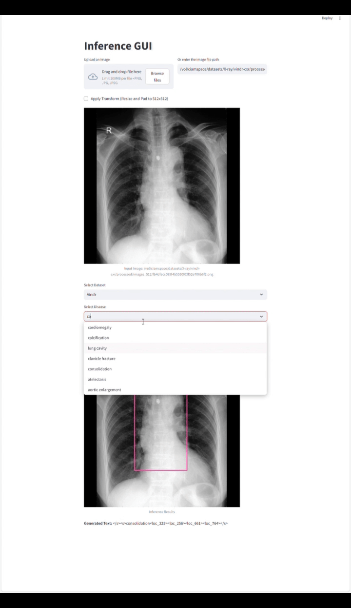

# 🚀 Enhancing Abnormality Grounding for Vision-Language Models with Knowledge Descriptions  

This repository contains the code for our paper:  
**"[Enhancing Abnormality Grounding for Vision-Language Models with Knowledge Descriptions](https://arxiv.org)"**.  


  
*🖼️ Overview of our approach: By integrating visual attribute-based textual descriptions during training, our 0.23B model achieves performance comparable to state-of-the-art (SOTA) 7B medical vision-language models (VLMs) in abnormality grounding.*  

## 📌 Usage Instructions  

### 🎯 Training  
To train the model, run:  
```bash
cd ./src
python pretrain.py
```

### 📊 Evaluation  

#### Evaluate on Datasets  
```bash
cd ./src
sh test.sh
```  
- 📡 Performance evaluation results will be automatically uploaded to **Weights & Biases (wandb)**.  
- 📄 The results will also be saved in `../res/ours_vindr_res.csv`.  

#### Evaluate Other SOTA Methods  

##### Evaluate Maira2  
```bash
cd ./evaluation
python test_maira2.py
python process_maira2_res.py
```  
- 📝 Results will be saved in `../res/maira_vindr_res.csv`.  

##### Evaluate RadVLM  
```bash
cd ./evaluation
python test_RadVLM.py
```  
- 📝 Results will be saved in `../res/maira_vindr_res.csv`.  

#### Visualizing Examples  
```bash
cd ./src
python compare_evluate.py
```  
- Visualization examples will be automatically uploaded to **Weights & Biases (wandb)**.  

  

### 🖥️ GUI Interface  
For an interactive graphical interface using **Streamlit**, run:  
```bash
cd ./models/inference
streamlit run streamlit_gui.py
```  

  


## 🏗️ Weights & Biases (wandb) Setup
To enable logging and visualization with **wandb**, follow these steps:
1. Install wandb if you haven't already:
   ```bash
   pip install wandb
   ```
2. Log in to wandb:
   ```bash
   wandb login
   ```
3. Set up the project in your script:
   ```python
   import wandb
   wandb.init(project="your_project_name")
   ```
