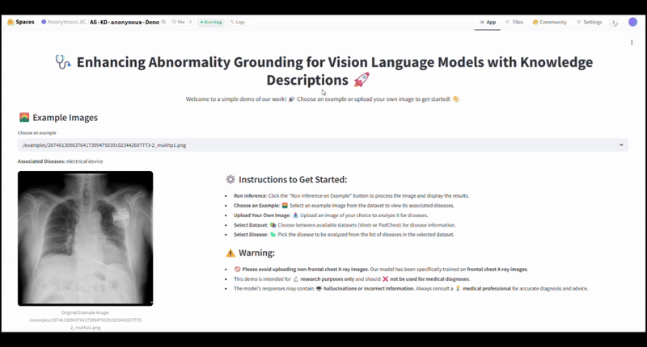
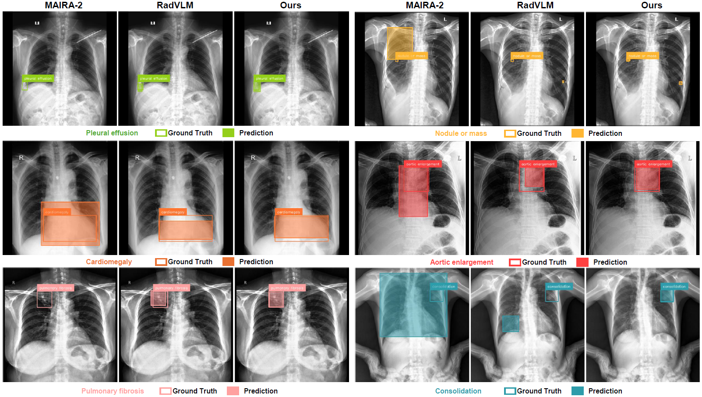
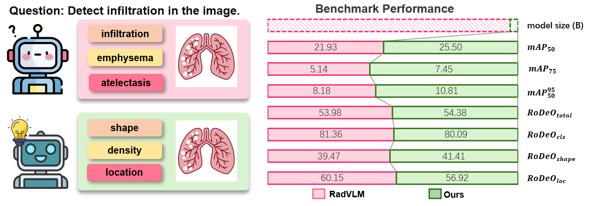

# 🚀 Enhancing Abnormality Grounding for Vision-Language Models with Knowledge Descriptions

<p align="center">
   📄 <strong><a href="https://arxiv.org/pdf/2503.03278">Paper</a></strong> &nbsp;&nbsp;│
   💻 <strong><a href="https://github.com/LijunRio/AG-KD">Code</a></strong> &nbsp;&nbsp;│
   🌐 <strong><a href="https://lijunrio.github.io/AG-KD/">Homepage</a></strong> &nbsp;&nbsp;│
   🤗 <strong><a href="https://huggingface.co/RioJune/AG-KD">Model</a></strong> &nbsp;&nbsp;│
   🌌 <strong><a href="https://huggingface.co/spaces/RioJune/AG-KD">Space</a></strong>
</p>


## ⚡ Quick Start — Try It Now

### 1.🌌 Hugging Face Space
You can directly try the model via our Hugging Face Space:

[https://huggingface.co/spaces/Anonymous-AC/AG-KD-anonymous-Demo](https://huggingface.co/spaces/Anonymous-AC/AG-KD-anonymous-Demo)




---

### 2. Run Locally — Example Code

Quickly try the model by running the example code in the [`simple_use`](./simple_use) folder:

```bash
python simple_use/simple_example.py
```

Or explore a more detailed example:

```bash
python simple_use/detailed_example.py
```

---

## 📌 Overview

Our 0.23B model delivers performance comparable to state-of-the-art (SOTA) 7B medical vision-language models (VLMs) in abnormality grounding.

<!-- ### Model Example -->

* Below are examples showcasing the model's capabilities:



* We propose a novel approach to abnormality grounding by integrating decomposed knowledge descriptions tied to visual features, as illustrated here:



## 🎯 Usage Instructions

### 🏗️ Setup

Before running any code, ensure all required dependencies are installed:

```bash
pip install -r requirements.txt
```

### 🔧 Training the Model

To train the model, navigate to the `src` directory and execute:

```bash
cd ./src
python pretrain.py
```

This will initiate the pretraining process.

### 📊 Evaluation

#### Evaluate on Datasets

To evaluate the model on datasets, run:

```bash
cd ./src
sh test.sh
```

* 📡 Performance results will be automatically uploaded to **Weights & Biases (wandb)**.
* 📄 Results will be saved in `../res/ours_vindr_res.csv`.

#### Evaluate Other SOTA Methods

You can also assess the performance of other SOTA methods on the same datasets.

##### 1. Evaluate Maira2

To evaluate the **Maira2** model:

```bash
cd ./evaluation
python test_maira2.py
python process_maira2_res.py
```

* 📝 Results will be saved in `../res/maira_vindr_res.csv`.

##### 2. Evaluate RadVLM

To evaluate the **RadVLM** model:

```bash
cd ./evaluation
python test_RadVLM.py
```

* 📝 Results will be saved in `../res/maira_vindr_res.csv`.

#### Visualizing Examples

To visualize evaluation examples:

```bash
cd ./src
python compare_evaluate.py
```

* Visualization results will be automatically uploaded to **Weights & Biases (wandb)**.

### 🖥️ Interactive GUI Interface

For an interactive graphical interface using **Streamlit**, execute:

```bash
cd ./src
streamlit run inference_gui.py
```

This will launch a Streamlit interface for seamless interaction with the model.

## 🏗️ Weights & Biases (wandb) Setup

To enable logging and visualization with **wandb**, follow these steps:

1. Install `wandb`:

   ```bash
   pip install wandb
   ```

2. Log in to `wandb`:

   ```bash
   wandb login
   ```

3. Initialize the project in your script:

   ```python
   import wandb
   wandb.init(project="your_project_name") in to `wandb`:

   ```bash
   wandb login
   ```

3. Initialize the project in your script:

   ```python
   import wandb
   wandb.init(project="your_project_name")
   ```
</details>

## 📖 Citation

If you use our work, please cite:

> **Note:** The paper is currently under review. If you are a reviewer, kindly refrain from accessing it during the rebuttal phase.

<details>
<summary>Cite</summary>

```
@article{li2025enhancing,
   title={Enhancing Abnormality Grounding for Vision Language Models with Knowledge Descriptions},
   author={Li, J. and Liu, C. and Bai, W. and Arcucci, R. and Bercea, C. I. and Schnabel, J. A.},
   journal={arXiv preprint arXiv:2503.03278},
   year={2025}
}
```

</details>

